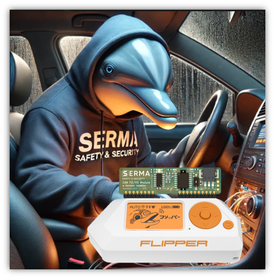

This software implements an USB to CAN bridge compatible with linux [can-utils](https://github.com/linux-can/can-utils) and slcan driver.  
This software application is designed to run on flipper zero device and needs SERMA CAN FD board to be plugged in GPIOs ports.
 

# Architecture overview

This application is composed by 2 main components:
- @ref APP : This is a  version of XTREME firmware [GPIO USB-UART bridge](https://github.com/Flipper-XFW/Xtreme-Firmware/blob/dev/applications/main/gpio/usb_uart_bridge.c) application modified to send data on CAN (via SPI) and not on UART.
- @ref CAN-DRIVER : Longan Labs [Longan_CANFD](https://github.com/Longan-Labs/Longan_CANFD) library driver for the MCP 2518 CAN transceiver ported on flipper zero platform.

Application is built as an external app using standard fbt commands. Please refer to flipper documentation for more information.

# Test status
Applications has been tested with a MCP2515 evaluation board. As a consequence, only the following datarates are tested :
- 125 Kbaud
- 250 Kbaud
- 500 Kbaud
- 1 MBaud
 

> **Note :** the flexible datarate is not tested yet.

# Known bugs

Multiple exit and enters in application and its submode produce instable behaviour.

